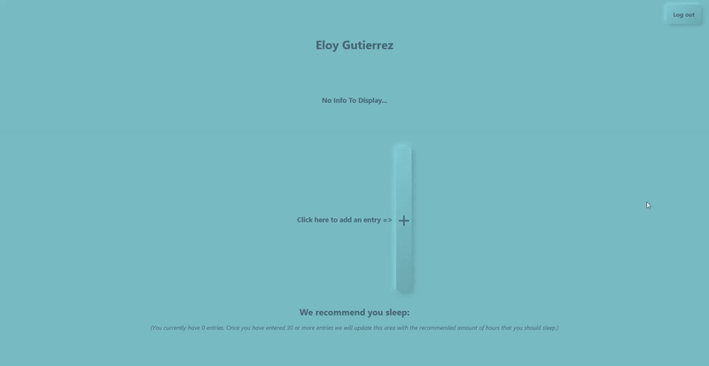

## Sleep Tracker
An app that allows you to keep track of hours slept per night and your mood after waking up. After 30 days the app will calculate the optimal amount of sleep you need to be in your best mood.

## How to use
To begin simply click the plus(**+**), put in the date your sleep began, the time it began, the time it ended on the next day, and finally how you felt when you woke up the next day.  
*Note: The example below is shown for a person going to sleep on 9/8/2021 at 10:00pm and waking up on 9/9/2021 at 5:00am.*  
  

  
## Recommended Amount Of Sleep
After 30 entries the app will recommend the ideal amount of hours that you should sleep each night based on your mood score after each day slept.
  

  